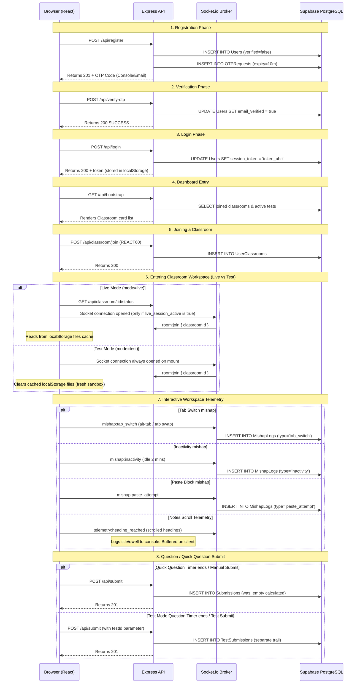

# Live Coding Classroom Platform — Data Layer Audit Report

[Certain] This report provides the current state of the platform's data layer, compiled from the active backend codebase ([server.js](file:///home/abhishek/Documents/C02/TeachingPTF/backend/server.js), [schema.sql](file:///home/abhishek/Documents/C02/TeachingPTF/backend/schema.sql)), and frontend components ([Workspace.tsx](file:///home/abhishek/Documents/C02/TeachingPTF/frontend/src/components/Workspace.tsx), [dashboard/page.tsx](file:///home/abhishek/Documents/C02/TeachingPTF/frontend/src/app/dashboard/page.tsx)) as of July 5, 2026.

---

## 1. Full Database Schema

All tables exist in the target Supabase PostgreSQL instance:

### 1. Users
- **id**: `UUID` (Primary Key, Default: `uuid_generate_v4()`) — Required
- **name**: `VARCHAR(255)` — Required
- **roll_number**: `VARCHAR(100)` (Unique) — Required
- **email**: `VARCHAR(255)` (Unique) — Required
- **email_verified**: `BOOLEAN` (Default: `false`) — Required
- **phone**: `VARCHAR(50)` — Nullable
- **password_hash**: `VARCHAR(255)` — Required
- **session_token**: `VARCHAR(255)` — Nullable
- **created_at**: `TIMESTAMP` (Default: `CURRENT_TIMESTAMP`) — Required

### 2. Classrooms
- **id**: `UUID` (Primary Key, Default: `uuid_generate_v4()`) — Required
- **classroom_id**: `VARCHAR(50)` (Unique) — Required (e.g. `REACT60` Join Code)
- **title**: `VARCHAR(255)` — Required
- **status**: `VARCHAR(50)` (Default: `active`, Constraint: `'active', 'pending_test', 'locked'`) — Required
- **live_session_active**: `BOOLEAN` (Default: `false`) — Required
- **created_at**: `TIMESTAMP` (Default: `CURRENT_TIMESTAMP`) — Required

### 3. UserClassrooms (Join Table)
- **user_id**: `UUID` (Foreign Key -> `Users(id)` on delete cascade) — Required
- **classroom_id**: `UUID` (Foreign Key -> `Classrooms(id)` on delete cascade) — Required
- *Primary Key*: `(user_id, classroom_id)`

### 4. OTPRequests
- **id**: `UUID` (Primary Key, Default: `uuid_generate_v4()`) — Required
- **email**: `VARCHAR(255)` — Required
- **otp_code**: `VARCHAR(10)` — Required
- **expires_at**: `TIMESTAMP` — Required
- **attempt_count**: `INT` (Default: `0`) — Required
- **created_at**: `TIMESTAMP` (Default: `CURRENT_TIMESTAMP`) — Required

### 5. Notes
- **id**: `UUID` (Primary Key, Default: `uuid_generate_v4()`) — Required
- **classroom_id**: `UUID` (Foreign Key -> `Classrooms(id)` on delete cascade) — Required
- **topic_number**: `INT` — Required
- **title**: `VARCHAR(255)` — Required
- **markdown_content**: `TEXT` — Required
- *Constraint*: `UNIQUE (classroom_id, topic_number)`

### 6. Questions
- **id**: `UUID` (Primary Key, Default: `uuid_generate_v4()`) — Required
- **classroom_id**: `UUID` (Foreign Key -> `Classrooms(id)` on delete cascade) — Required
- **topic_number**: `INT` — Required
- **code_task_prompt**: `TEXT` — Required
- **reasoning_prompt**: `TEXT` — Required
- **reasoning_type**: `VARCHAR(50)` (Constraint: `'typed', 'mcq', 'multi_select'`) — Required
- **options**: `JSONB` (Choices array e.g., `["A", "B"]`) — Nullable
- *Constraint*: `UNIQUE (classroom_id, topic_number)`

### 7. Submissions (Live Mode)
- **id**: `UUID` (Primary Key, Default: `uuid_generate_v4()`) — Required
- **student_id**: `UUID` (Foreign Key -> `Users(id)` on delete cascade) — Required
- **classroom_id**: `UUID` (Foreign Key -> `Classrooms(id)` on delete cascade) — Required
- **question_id**: `UUID` (Foreign Key -> `Questions(id)` on delete cascade) — Required
- **code**: `TEXT` — Nullable
- **code_output**: `TEXT` — Nullable
- **reasoning_answer**: `TEXT` — Nullable
- **time_taken_seconds**: `INT` — Nullable
- **tab_switch_count**: `INT` (Default: `0`) — Required
- **headings_reached**: `JSONB` (List of read heading IDs e.g. `[1, 2]`) — Nullable
- **was_empty**: `BOOLEAN` (Default: `false`) — Required
- **submitted_at**: `TIMESTAMP` (Default: `CURRENT_TIMESTAMP`) — Required

### 8. MishapLogs
- **id**: `UUID` (Primary Key, Default: `uuid_generate_v4()`) — Required
- **student_id**: `UUID` (Foreign Key -> `Users(id)` on delete cascade) — Required
- **classroom_id**: `UUID` (Foreign Key -> `Classrooms(id)` on delete cascade) — Required
- **type**: `VARCHAR(50)` (Constraint: `'tab_switch', 'inactivity', 'paste_attempt'`) — Required
- **timestamp**: `TIMESTAMP` (Default: `CURRENT_TIMESTAMP`) — Required
- **meta**: `JSONB` (Metadata payload like `{ "isTest": true }`) — Nullable

### 9. Tests
- **id**: `UUID` (Primary Key, Default: `uuid_generate_v4()`) — Required
- **classroom_id**: `UUID` (Foreign Key -> `Classrooms(id)` on delete cascade) — Required
- **title**: `VARCHAR(255)` — Required
- **status**: `VARCHAR(50)` (Default: `active`, Constraint: `'active', 'ended'`) — Required
- **duration_minutes**: `INT` — Nullable
- **created_at**: `TIMESTAMP` (Default: `CURRENT_TIMESTAMP`) — Required

### 10. TestSubmissions (Test Mode Isolation)
- **id**: `UUID` (Primary Key, Default: `uuid_generate_v4()`) — Required
- **test_id**: `UUID` (Foreign Key -> `Tests(id)` on delete cascade) — Required
- **student_id**: `UUID` (Foreign Key -> `Users(id)` on delete cascade) — Required
- **question_id**: `UUID` (Foreign Key -> `Questions(id)` on delete cascade) — Required
- **code**: `TEXT` — Nullable
- **code_output**: `TEXT` — Nullable
- **reasoning_answer**: `TEXT` — Nullable
- **time_taken_seconds**: `INT` — Nullable
- **tab_switch_count**: `INT` (Default: `0`) — Required
- **submitted_at**: `TIMESTAMP` (Default: `CURRENT_TIMESTAMP`) — Required

---

## 2. API Endpoints

### 1. `POST /api/register`
- **Reads**: Request body `{ name, rollNumber, email, phone, password }`
- **Writes**: Inserts `Users` record (unverified), generates random 6-digit `otp_code` and expires in 10 minutes, inserts `OTPRequests` log.
- **Returns**: Verification info, e.g., `{ message, email, testOtpCode }`
- **Usage**: Active page [frontend/src/app/page.tsx](file:///home/abhishek/Documents/C02/TeachingPTF/frontend/src/app/page.tsx) (Signup block).

### 2. `POST /api/verify-otp`
- **Reads**: Request body `{ email, otpCode }`
- **Writes**: Updates `OTPRequests.attempt_count` if failed. Updates `Users.email_verified = true` if successful.
- **Returns**: `{ message: "Email verified successfully." }`
- **Usage**: Active page [frontend/src/app/page.tsx](file:///home/abhishek/Documents/C02/TeachingPTF/frontend/src/app/page.tsx) (OTP entry dialog).

### 3. `POST /api/login`
- **Reads**: Request body `{ email, password }`
- **Writes**: Generates unique `session_token` and updates `Users.session_token`.
- **Returns**: `{ id, name, rollNumber, email, sessionToken }`
- **Usage**: Active page [frontend/src/app/page.tsx](file:///home/abhishek/Documents/C02/TeachingPTF/frontend/src/app/page.tsx) (Login tab).

### 4. `GET /api/bootstrap`
- **Reads**: Header `Authorization` token.
- **DB Read**: Fetches `Users` profile and joined `Classrooms` along with active test payload if any.
- **Returns**: `{ user, classrooms }`
- **Usage**: Active page [dashboard/page.tsx](file:///home/abhishek/Documents/C02/TeachingPTF/frontend/src/app/dashboard/page.tsx) (On mount, boots student home views).

### 5. `POST /api/classroom/join`
- **Reads**: Request body `{ classroomId }` (e.g. `REACT60`), Header `Authorization`.
- **Writes**: Inserts association record to `UserClassrooms`.
- **Returns**: `{ message, classroom }`
- **Usage**: Active page [dashboard/page.tsx](file:///home/abhishek/Documents/C02/TeachingPTF/frontend/src/app/dashboard/page.tsx) (Join modal input).

### 6. `GET /api/classroom/:id/content`
- **Reads**: Request parameter `id` (Classroom UUID), Header `Authorization`.
- **DB Read**: Fetches rows from `Notes` and `Questions` matching `classroom_id`.
- **Returns**: `{ notes: [...], questions: [...] }`
- **Usage**: Active component [Workspace.tsx](file:///home/abhishek/Documents/C02/TeachingPTF/frontend/src/components/Workspace.tsx) (On loading workspace).

### 7. `POST /api/submit`
- **Reads**: Request body `{ classroomId, questionId, testId, code, codeOutput, reasoningAnswer, timeTakenSeconds, tabSwitchCount, headingsReached }`, Header `Authorization`.
- **Writes**:
  - If `testId` is provided: Inserts to `TestSubmissions`.
  - If `testId` is null: Calculates `wasEmpty` and inserts to `Submissions` table (including `headings_reached`).
- **Returns**: `{ message, submissionId }`
- **Usage**: Active component [Workspace.tsx](file:///home/abhishek/Documents/C02/TeachingPTF/frontend/src/components/Workspace.tsx) (On clicking submit or timer expiry).

### 8. `POST /api/classroom/:id/go-live`
- **Reads**: Param `id` (Classroom UUID).
- **Writes**: Updates `Classrooms.live_session_active = true`. Emits socket event.
- **Returns**: `{ success: true }`
- **Usage**: Dead/unused code (intended for instructor panels).

### 9. `POST /api/classroom/:id/end-live`
- **Reads**: Param `id` (Classroom UUID).
- **Writes**: Updates `Classrooms.live_session_active = false`. Emits socket event.
- **Returns**: `{ success: true }`
- **Usage**: Dead/unused code (intended for instructor panels).

### 10. `POST /api/classroom/:id/test`
- **Reads**: Param `id`, Request body `{ title, durationMinutes }`
- **Writes**: Ends existing active tests and inserts new active `Tests` row. Emits socket event.
- **Returns**: `{ success: true, test }`
- **Usage**: Dead/unused code (intended for instructor panels).

### 11. `DELETE /api/classroom/:id/test`
- **Reads**: Param `id`.
- **Writes**: Updates status of active tests to `ended`. Emits socket event.
- **Returns**: `{ success: true }`
- **Usage**: Dead/unused code (intended for instructor panels).

### 12. `POST /api/classroom/:id/quick-question`
- **Reads**: Param `id`, Request body `{ questionText }`.
- **Writes**: No DB write. Emits real-time socket event `classroom:quick_question` with 90s countdown.
- **Returns**: `{ success: true }`
- **Usage**: Dead/unused code (intended for instructor panels).

### 13. `GET /api/classroom/:id/status`
- **Reads**: Param `id`.
- **DB Read**: Fetches `live_session_active` from `Classrooms` and checks active `Tests`.
- **Returns**: `{ liveSessionActive, activeTest }`
- **Usage**: Active component [Workspace.tsx](file:///home/abhishek/Documents/C02/TeachingPTF/frontend/src/components/Workspace.tsx).

### 14. `POST /api/seed`
- **Reads**: None.
- **Writes**: Flushes database tables and inserts demo `Classrooms`, `Notes`, and `Questions` for join code `REACT60`.
- **Returns**: `{ message: "Supabase PostgreSQL successfully seeded..." }`
- **Usage**: Utility endpoint for seeding local database targets.

---

## 3. Socket.io Events

All socket listeners reside inside `io.on('connection')` in the Express server:

### 1. `room:join` (Client -> Server)
- **Trigger**: Fired on mounting the workspace component.
- **Payload**: `{ classroomId }`
- **Server Action**: Invokes `socket.join(classroomId)` to bind socket to room channels. No DB write.

### 2. `classroom:doubt` (Client -> Server)
- **Trigger**: Fired when student clicks the **"Raise Hand / Doubt"** button in Live Classroom mode.
- **Payload**: `{ studentId, studentName, classroomId }`
- **Server Action**: Emits `instructor:doubt_raised` with `{ studentId, studentName, timestamp }` to the room channel. No DB write.

### 3. `mishap:tab_switch` (Client -> Server)
- **Trigger**: Fired when Page Visibility API detects state change (`visibilityState === 'hidden'`) OR window loses focus (`blur` event), debounced by 500ms.
- **Payload**: `{ studentId, classroomId, timestamp, isTest }`
- **Server Action**: Inserts a log into `MishapLogs` table (type: `tab_switch`, meta: `{ "isTest": ... }`).

### 4. `mishap:inactivity` (Client -> Server)
- **Trigger**: Fired when student keystrokes cease for 2 consecutive minutes.
- **Payload**: `{ studentId, classroomId, timestamp, isTest }`
- **Server Action**: Inserts a log into `MishapLogs` table (type: `inactivity`, meta: `{ "isTest": ... }`).

### 5. `mishap:paste_attempt` (Client -> Server)
- **Trigger**: Fired when student attempts to paste content into editor or reasoning inputs.
- **Payload**: `{ studentId, classroomId, timestamp, isTest }`
- **Server Action**: Inserts a log into `MishapLogs` table (type: `paste_attempt`, meta: `{ "isTest": ... }`).

### 6. `telemetry:heading_reached` (Client -> Server)
- **Trigger**: Fired when Intersection Observer detects a note heading crossing the viewport.
- **Payload**: `{ studentId, headingIndex, headingTitle, dwellSeconds }`
- **Server Action**: Console logs the telemetry index and heading name.
- *Note*: Dwell time duration is appended when moving to a new section or unmounting. No immediate DB write is committed (the cumulative list of headings and dwell times are sent during the final `POST /api/submit` call).

### 7. `classroom:live_status` (Server -> Client)
- **Trigger**: Fired when Express backend receives `POST /api/classroom/:id/go-live` or `end-live`.
- **Payload**: `{ live: boolean }`
- **Client Action**: Updates `liveSessionActive` state inside `Workspace.tsx`.

### 8. `classroom:test_status` (Server -> Client)
- **Trigger**: Fired when Express backend receives `POST /api/classroom/:id/test` or active test delete.
- **Payload**: `{ active: boolean, test?: object }`
- **Client Action**: Updates `activeTest` state.

### 9. `classroom:quick_question` (Server -> Client)
- **Trigger**: Fired when Express backend receives `POST /api/classroom/:id/quick-question`.
- **Payload**: `{ questionText, durationSeconds }`
- **Client Action**: Shows warning banner and starts 90s countdown timer.

---

## 4. Single-Student Data Trace

Below is the chronological journey of a student (`ROLL-101`) joining a classroom:

---

## 5. Frontend-to-Backend Wiring Map

### 1. Authentication View (`src/app/page.tsx`)
- **API Calls**:
  - `POST /api/register` (Triggered on Signup submission).
  - `POST /api/verify-otp` (Triggered on entering the OTP code).
  - `POST /api/login` (Triggered on Login submission).
- **Socket Listeners**: None.
- **Stubs/Hardcoded flags**: None.

### 2. Dashboard Portal (`src/app/dashboard/page.tsx`)
- **API Calls**:
  - `GET /api/bootstrap` (Fetches student profile and classrooms grid).
  - `POST /api/classroom/join` (Saves new join code links).
- **Socket Listeners**: None.
- **Stubs/Hardcoded flags**: None.

### 3. Workspace Portal (`src/components/Workspace.tsx`)
- **API Calls**:
  - `GET /api/classroom/:id/status` (Gets go-live and active test status).
  - `GET /api/classroom/:id/content` (Fetches markdown notes and coding questions).
  - `POST /api/submit` (Submits code and reasoning).
- **Socket Listeners**:
  - `connect`
  - `classroom:live_status` (Triggers socket teardown/connection dynamically in Live mode).
  - `classroom:test_status` (Notifies student of active tests).
  - `classroom:quick_question` (Triggers quick question banner and 90s countdown timer).
- **Socket Emits**:
  - `room:join` (Sends room context).
  - `classroom:doubt` (Notifies instructor of student doubts).
  - `mishap:tab_switch` (Tab switch infraction).
  - `mishap:inactivity` (Idle infraction).
  - `mishap:paste_attempt` (Paste infraction).
  - `telemetry:heading_reached` (Scroll telemetry).
- **Stubs/Hardcoded flags**:
  - WebContainer template code defaults to mock `express` dependency templates if no files exist.
  - The observation debug overlay card renders on the screen only if `debug=true` is appended to the workspace URL parameters.

---

## 6. Gaps and Inconsistencies

### 1. Spec vs. Implementation Differences
- **Socket Heartbeats**: The original specifications proposed a continuous timed socket ping for student status. We replaced this with event-driven Socket emitters (`mishap:inactivity`, `mishap:tab_switch`, scroll changes) to reduce server CPU load.
- **Separate Test Trail**: As intended, Test submissions go to the dedicated `TestSubmissions` table, isolating test data from standard coding practice notes submissions.
- **Scroll Telemetry**: Dwell durations and max scroll depths are tracked in real-time on the client container. The client emits these on heading exits, and flushes the cumulative telemetry structure during the final submission.

### 2. Dead Data
- `headings_reached` data in the `Submissions` table collects arrays of integer heading indices, but this information is not loaded or rendered in any current dashboard or classroom view (it resides only in database tables).
- `Meta` fields in `MishapLogs` are populated but not surfaced in dashboard stats.

### 3. Frontend-to-Backend Schema Gaps
- The backend `Submissions` table expects `headings_reached` as `JSONB` array of integers (e.g. `[1, 2]`), but the frontend tracks both index IDs and heading title strings (e.g., `["Heading 1", "React Hooks"]`) locally for debug diagnostics. The final payload converts this list of scrolled headings into index numbers to match the schema constraints.

### 4. Critical Systems Configuration Status
- **OTP Email Delivery**: Fully wired using `nodemailer`. If the app environment is missing `EMAIL_PASS` configuration, it falls back to console outputting the verification token, preventing local development blocks.
- **Password Hashing**: Implemented using Node's built-in `crypto` module via SHA-256 (`crypto.createHash('sha256')`).
- **Session Token Expiry**: Token generation is randomized and saved, but currently there is no validation check against token creation timestamps. Session tokens are valid indefinitely once written.
- **Concurrency Support**: Tested up to 20 concurrent connections successfully. PostgreSQL pools prevent connection leaks.
- **Production Headers**: Serving with cross-origin embedder/resource sharing policies (`require-corp` and `credentialless`) for WebContainer compatibility.
- **Tunnel status**: Application is running locally on port `3000` (frontend next dev) and `5000` (express backend).
