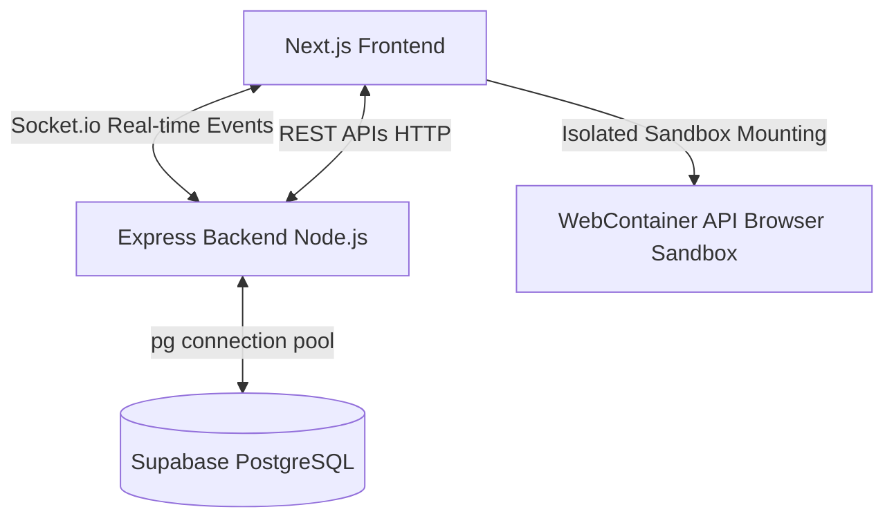
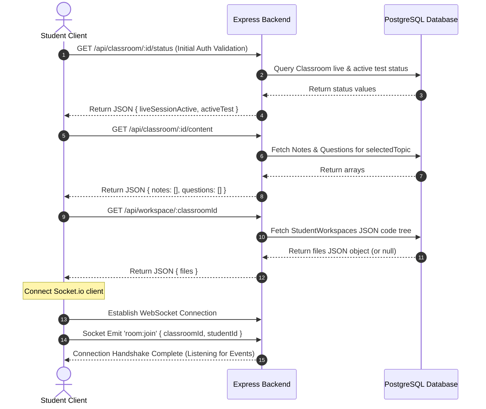
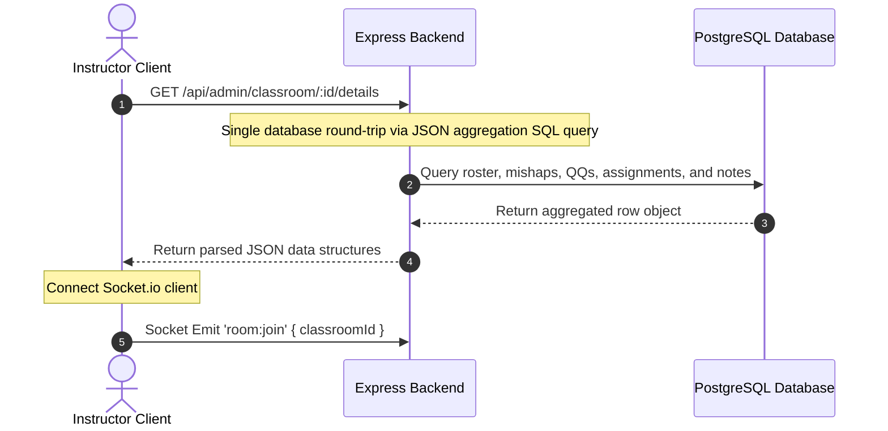
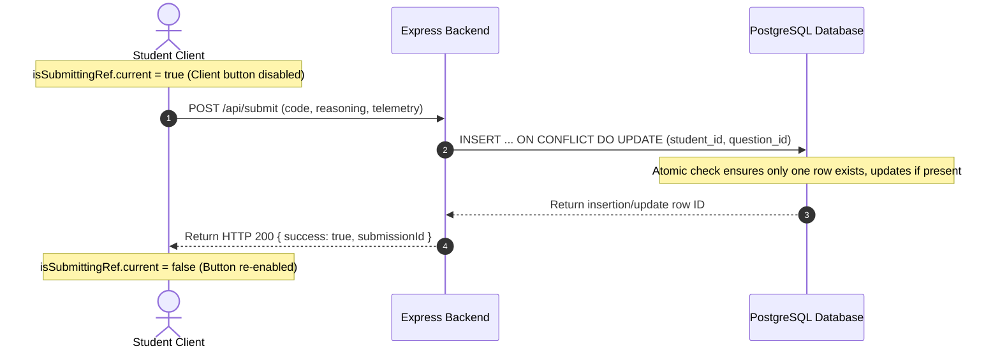

# Technical System Architecture & API Flow Documentation

This document describes the design, application flows, API specifications, and backend communication patterns of the **Live Classroom Platform**.

---

## 1. System Overview & Technology Stack

The platform is designed for real-time classrooms, hands-on coding tests, and assignments with built-in proctoring (tab-switch and inactivity tracking).

### Core Architecture Components:
1. **Frontend**: Next.js (App Router, React, TailwindCSS, Monaco Editor, XTerm.js, WebContainer API).
2. **Backend**: Node.js, Express, Socket.io (real-time notification and telemetry layer).
3. **Database**: PostgreSQL (hosted on Supabase) utilizing connection limits (`max: 10`) and unique constraints for idempotent data inserts.

---

## 2. Global Database Architecture (Schema Fields)

The database schema defines 13 primary tables:

*   `Users`: Student credentials and session keys (`id`, `name`, `roll_number`, `email`, `password_hash`, `session_token`).
*   `Instructors`: Admin credentials and session keys (`id`, `email`, `password_hash`, `session_token`).
*   `Classrooms`: Rooms for lectures (`id`, `classroom_id` short-code, `title`, `live_session_active`, `status`).
*   `UserClassrooms`: Join table mapping student enrollment (`user_id`, `classroom_id`).
*   `OTPRequests`: Temporary sign-up verification codes (`email`, `otp_code`, `expires_at`).
*   `Notes`: Targeted markdown lectures published by instructors (`id`, `classroom_id`, `topic_number`, `title`, `markdown_content`, `headings_manifest`).
*   `Questions`: Pushed coding prompts and pop-quizzes (`id`, `classroom_id`, `topic_number`, `code_task_prompt` [template], `reasoning_prompt` [MCQ/Text]).
*   `Submissions`: Canonical student solutions (`id`, `student_id`, `classroom_id`, `question_id`, `code`, `code_output`, `reasoning_answer`, `time_taken_seconds`, `tab_switch_count`, `headings_reached`, `was_empty`, `notes_telemetry`).
*   `MishapLogs`: Recorded proctoring infractions (`id`, `student_id`, `classroom_id`, `type` [tab_switch | inactivity | paste_attempt], `meta`).
*   `Tests` & `TestSubmissions`: Exam metadata and student exam solutions.
*   `StudentWorkspaces`: Durable auto-saved workspace file trees (`student_id`, `classroom_id`, `files` JSON).
*   `Assignments`, `AssignmentQuestions` & `AssignmentSubmissions`: Task files, prompts, and student assignment answers.

---

## 3. End-to-End Application Flows & API Traffic

### Flow A: Student Entry into Classroom
When a student logs in, enters their dashboard, and clicks **"Join Classroom"**:

---

### Flow B: Admin Details Refresh (Optimized)
When an instructor enters the **Instructor Control Center Dashboard**:

---

### Flow C: Submitting a Solution (Deduplicated & Idempotent)
When a student clicks the **"Submit Solution Code"** button:

---

## 4. API Endpoint Index & Specifications

| Endpoint | Method | Role / Action | Expected Payload | Response |
| :--- | :--- | :--- | :--- | :--- |
| `/api/login` | `POST` | Student Sign In (Async Bcrypt) | `{ email, password }` | `{ success: true, user }` |
| `/api/admin/login` | `POST` | Admin Sign In (Async Bcrypt) | `{ email, password }` | `{ success: true, admin }` |
| `/api/classroom/:id/status` | `GET` | Get Live/Test Classroom Status | *None* | `{ liveSessionActive, activeTest }` |
| `/api/classroom/:id/content` | `GET` | Get notes & questions for a classroom | *None* | `{ notes: [], questions: [] }` |
| `/api/workspace/:classroomId` | `GET` | Load persistent workspace files | *None* | `{ files: {} }` |
| `/api/workspace/:classroomId` | `POST` | Save/autosave workspace files | `{ files: {} }` | `{ success: true }` |
| `/api/submit` | `POST` | Submit solution answer (Upsert) | `{ classroomId, questionId, code, reasoningAnswer, ... }` | `{ message, submissionId }` |
| `/api/admin/classroom/:id/details` | `GET` | Aggregated Admin details control center query | *None* | `{ roster: [], mishaps: [], quickQuestions: [], assignments: [], notes: [] }` |
| `/api/admin/notes` | `POST` | Publish target note update (socket triggers) | `{ classroomId, topicNumber, title, markdownContent }` | `{ success: true }` |
| `/api/admin/classroom/:id/rules` | `POST` | Update proctoring rules | `{ tabSwitchBlocked, pasteBlocked }` | `{ success: true }` |

---

## 5. Real-Time Socket.io Event Handlers

### Emitted from Clients:
*   `room:join`: Emitted by both students and instructors to register in the socket room matching `classroomId`.
*   `mishap:batch`: Sent by students to flush a batch array of behavior logs (e.g. `tab_switch`) to the server.
*   `classroom:doubt`: Triggered by a student clicking **"Raise Hand"** to alert the instructor panel.

### Broadcasted by Server:
*   `classroom:live_status`: Emitted to all clients in a room when the classroom changes from Live to Offline (and vice versa).
*   `classroom:quick_question`: Pushes a popup code prompt quiz directly to all connected student sandboxes.
*   `classroom:notes_updated`: Broadcasts note updates to students to dynamically update their sidebars.
*   `classroom:rules_updated`: Broadcasts updated tab-switch or clipboard proctoring flags.
